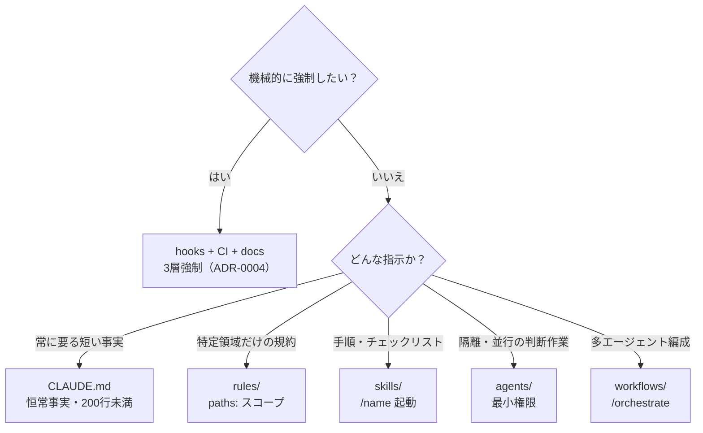
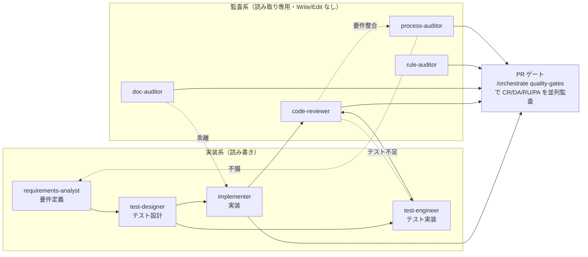

# .claude/ — steering 構成の案内

このディレクトリが deb の中核。「どの指示をどの機構に置くか」の設計は ADR-0001、
編集規約は `rules/claude-config.md`（.claude/ を触ると自動ロードされる）を参照。

## 一覧

| ディレクトリ | 機構 | 読み込みタイミング |
|---|---|---|
| `rules/` | 領域別規約（`paths:` スコープ） | 該当ファイルに触れた時 |
| `skills/` | 手続き的ワークフロー | `/name` 起動時 |
| `agents/` | 隔離実行する役割（最小権限） | 委譲時 |
| `workflows/` | 決定論的オーケストレーション（JS） | /orchestrate 経由の明示要求時 |
| `hooks/` | 決定論的強制（exit 2 ブロック） | イベント発火時（コンテキスト外） |
| `settings.json` | permissions + hooks 配線 | 常時 |

### 機構配置マップ（どこに何を置くか。ADR-0001）

「その指示をどの機構に置くべきか」の決定ガイド。読み込みコスト（常時→起動時）と強制力で選ぶ。

## hooks の一覧

| フック | イベント | 内容 |
|---|---|---|
| session-start.sh | SessionStart | ブランチ・変更・直近 ADR・ゲート状態を要約して注入 |
| guard-git.sh | PreToolUse(Bash) | main への push / force push をブロック |
| guard-protected.sh | PreToolUse(Edit\|Write) | .env・鍵・ロックファイル・Accepted ADR の編集をブロック |
| quality-gate.sh | Stop | 未コミット変更があれば scripts/check.sh を実行し、失敗ならターン終了をブロック |

## 開発プロセスとの関係

steering は開発プロセス（`docs/process/`、ADR-0005〜0007）を機構化したもの。要件定義は `/spec` と
`requirements-analyst`、テスト設計は `/test-design` と `test-designer`、予防活動は `/postmortem`、
プロセス遵守監査は `process-auditor`、トレーサビリティ検証は `scripts/check-traceability.sh` が担う。

### エージェント連携図

実装系（読み書き）が要件→設計→実装→テストを進め、監査系（読み取り専用）が PR ゲートで多角監査する。
点線は「指摘に応じて次に呼ぶエージェント」（各エージェントの推奨フォローアップ／残課題）。

## 拡張の指針

- 機械的に強制できるルール → hooks（+ CI + ドキュメントの3層。ADR-0004）
- 判断を伴う監査 → agents（読み取り専用で）
- 固定手順 → skills
- 変更したら `bash scripts/validate-foundation.sh` を通し、CLAUDE.md の一覧表と同期する
